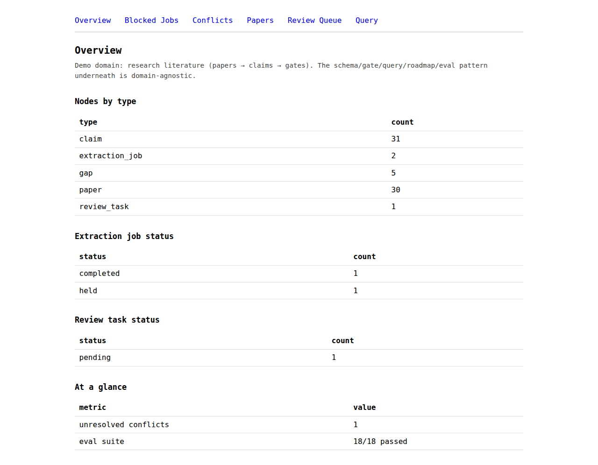
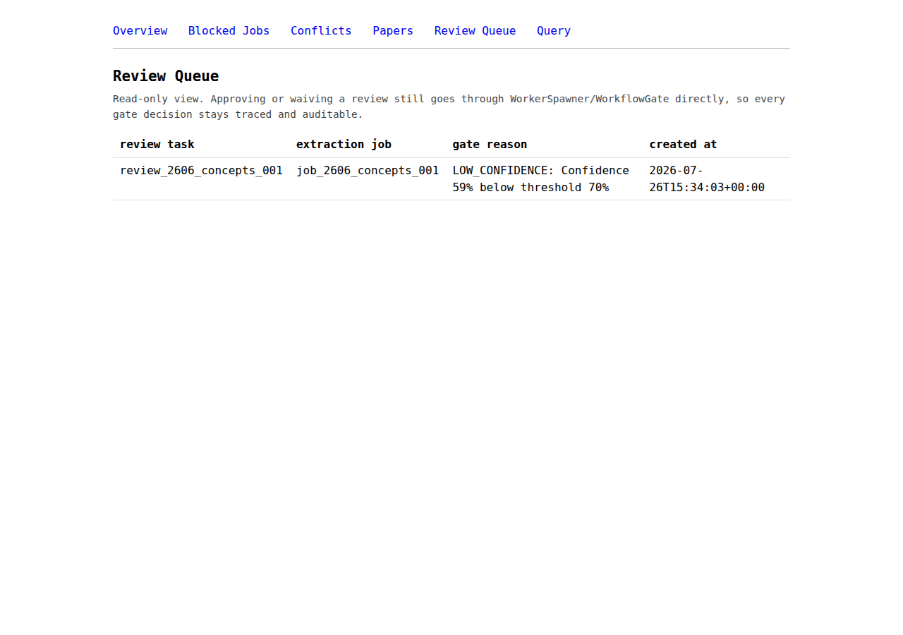

# research-graph-engine

A **governed workflow engine** with two distinct enforcement points, not one
blurred into the other:

- **Before an action runs** — `action_policy.py`'s `ActionPolicy` evaluates a
  *proposed* extraction (which paper, which extraction type, at what confidence
  floor) and returns allowed / escalated / blocked *before* any worker is
  invoked. A blocked or escalated action never runs at all — not "runs, then
  gets rejected later."
- **After a claim is produced** — `research_graph_gates.py`'s `WorkflowGate`
  evaluates the *already-extracted* claim/concept (schema, provenance, claim
  entailment, confidence, human review, conflicts, downstream eligibility) and
  decides whether it can advance, with every verdict traced back to a reason.

Papers go in; validated, provenance-tracked claims and concepts come out — and
nothing runs, and nothing it produces advances, without a decision that
records *why*.

Research literature is this repo's one worked example, not its ceiling. The
same schema/gate/query/roadmap/eval pattern applies to anything shaped like
*extract a claim from a source, decide if it's trustworthy enough to act on,
let a human override that decision on the record* — hiring pipelines, ops
approvals, compliance review, or any other domain where "why was this
allowed through" has to be an answerable question, not a shrug.

The point isn't the extraction. It's that every node in the graph can answer:
who produced me, from what source, with what confidence, which checks did I
pass, and if a human waived one of those checks — who, and on what grounds.
And now, one step earlier: was the action that produced me even authorized to
run in the first place, or did a human have to approve it first.

## The pipeline

| Layer | File | What it does |
|---|---|---|
| Schema | `research_graph_schema.py` | Closed node/edge types, structured traces, validation with reason codes — not a bare bool |
| Action policy | `action_policy.py` | Runtime, pre-execution enforcement: `ActionPolicy.authorize()` evaluates a proposed extraction *before* any worker runs, returning allowed/escalated/blocked from pluggable rules (`deny_extraction_types`, `require_escalation_for`, `max_results_ceiling`). `authorize_then_spawn()` is the actual enforcement point — a blocked or escalated action never spawns a job or invokes a worker; `approve_escalated_action()` is the only way an escalated one proceeds. Distinct from the gate below: this decides whether the extraction happens at all, not whether its output can advance. `authorize_execute_then_admit()` closes a second gap literature on real-time agent enforcement names ("observe-but-do-not-act"): pluggable post-execution rules (`block_low_average_confidence_outcome`, `max_nodes_produced_ceiling`, `escalate_on_worker_failure`) re-evaluate what a worker *actually* produced before `spawner.admit()` ever runs — the worker's side effects can't be undone, but a blocked/escalated outcome never reaches the graph; `approve_escalated_outcome()` admits an already-produced, held envelope without re-invoking the worker |
| Gate | `research_graph_gates.py` | `WorkflowGate.should_unlock_next_stage()` — seven deterministic checks (schema, provenance, claim entailment, confidence, human review, conflicts, downstream eligibility), every verdict traced |
| Claim verification | `claim_verification.py` | `keyword_overlap_entailment_checker()` — pluggable into the gate's `_check_claim_entailed`; a claim citing a real source that doesn't actually support it now fails on `CLAIM_NOT_ENTAILED`, not just on hand-assigned low confidence. `atomic_entailment_checker()` decomposes a compound claim into clauses and requires the *weakest* one to clear the bar, so a single unsupported clause can't hide behind a well-supported one (`atomic_entailment_report()` exposes per-atom detail as a separate diagnostic) |
| Workers | `research_graph_workers.py` | `ExtractionDirective` in, `ResultEnvelope` out; `WorkerSpawner` is the only writer to the graph, and treats every worker as untrusted. `ReferenceWorker` extracts claims, concepts, and benchmarks (deliberately dumb heuristics — proving the loop closes, not extraction quality). `admit()` supports a bounded, audited retry (`retry_with`/`max_retries`, default off) instead of failing a rejected envelope wholesale. `classify_rejection()` classifies a rejection into one of five broad failure classes, for a caller's own retry strategy to consult |
| LLM worker | `llm_worker.py` | `LLMWorker` — a drop-in for `ReferenceWorker` backed by a real Claude API call instead of regex heuristics, satisfying the exact same envelope contract (`WorkerSpawner.admit()` doesn't know or care which produced it). `call_model` is injected (same pattern as `arxiv_ingest.py`'s `http_get`), so parsing/envelope logic is fully tested without a network call; the real call path needs `ANTHROPIC_API_KEY`, which this sandbox has never had, so it's written but not exercised end-to-end here — said plainly, not left implicit. Prompts are domain-pluggable (`domain=` — `research` (default), `hiring`, `ops_approval`, `compliance` — or a full `prompt_overrides` escape hatch), backing up the README's own claim that this pattern generalizes past research literature: only the framing sentence changes per domain, the JSON field contract stays identical |
| Graph memory | `graph_memory.py` | The other legitimate writer besides workers: persists task outcomes, accepted/rejected claims, reviewer disagreements, confidence divergence (derivation- vs. validation-time), action-policy decisions (audit evidence for `action_policy.py`), blocked reasons, and repair patterns as typed `MEMORY_RECORD` nodes (`SUPPORTED_BY`/`REJECTED_BECAUSE`/`DISAGREED_ON`/`REPAIRED_VIA`/`DERIVED_FROM` edges) — structured graph data, not a flattened transcript. `specialist_trust_scores()` aggregates recorded disagreements into a per-role agreement/disagreement tally against each disputed node's own eventual outcome. `provenance_trust_weight_for()`/`provenance_bound_confidence()` cap a node's self-reported confidence by how independently verified its source actually is, instead of trusting the raw figure at face value; `provenance_weighted_trust_scores()` is the same disagreement tally as `specialist_trust_scores()` but weighted by that provenance trust rather than counted flat. `retract_memory_record()`/`is_retracted()`/`active_memory_records_for()` give "Forget & Rollback" a real, append-only representation — a retraction is itself a new record linked back to what it retracts, never a deletion |
| Orchestrator | `graph_orchestrator.py` | Fan-out over one paper to the claim/concept/benchmark extractors, collected into one `OrchestrationReport` — schema validation, conflict detection, and the gate decision all still happen inside the *unchanged* `WorkerSpawner.admit()`, not duplicated here |
| Specialist agent split | `specialist_review.py` | Four bounded roles (extractor, schema validator, conflict checker, reviewer/judge) run as an explicit `task_graph.TaskDAG` (`extract` → `{conflict_check, schema_validate}` in parallel → `reviewer_judge`), each an independent, always-completed `SpecialistVerdict`, reconciled into one `SpecialistPipelineReport` — multi-dimensional review instead of one scalar `ReviewStatus`/confidence, without touching the gate itself; disagreement between specialists is persisted via `graph_memory.record_disagreement` before the real, unchanged `WorkerSpawner.admit()` runs. `resume_specialist_pipeline()` resumes only the stale (failed/skipped) tasks after a partial failure instead of redoing the whole pipeline, optionally filtered by `classify_specialist_failure()`'s failure class. `diagnose_pipeline_failure()` gives a trajectory-level view over a whole run — root-cause task(s), blast radius, and whether the failure originated at the orchestrating role (`reviewer_judge`) itself versus cascading from upstream — complementing `classify_specialist_failure()`'s per-task view without changing what gets retried |
| Conflict detection | `research_graph_schema.detect_conflicts_in_graph()` | Deterministic heuristics first — same subject/object, opposed relation |
| Inspection | `graph_inspector.py` | Plain-text report: papers, claims, conflicts, jobs, held/review-required, and *why* a gate blocked each one (re-runs the live gate, not a cached string) |
| Query layer | `graph_queries.py` | `get_node`, `neighbors`, `claims_for_paper`, `contradicting_claims`, `why_blocked`, `search`, `detect_job_dependency_cycles`, `derivation_mechanism_for`/`derivation_mechanism_breakdown` — structured answers, not text to parse |
| Roadmap | `graph_roadmap.py` | Rolls GAP/METHOD/DOMAIN/BENCHMARK nodes up by how many papers substantiate each one |
| Evaluation | `graph_evals.py` | Quality, not just correctness: query-answer evals, gate-decision audits, extraction precision/recall, and a regression set that must never silently start passing again |
| Web UI | `webapp.py` | FastAPI: graph overview, blocked jobs, unresolved conflicts, paper → claims drilldown, review queue, and a small query box over the graph |
| Live ingestion | `arxiv_ingest.py` | Real calls to the public arXiv API, converted into schema-conforming PAPER nodes, idempotent against re-running the same query |
| Worked example | `literature_corpus.py` | 29 real papers (three survey rounds) entered as graph data, each `ADDRESSES` a capability gap this repo used to decide what to build next — the repo dogfooding its own schema to plan itself |
| Run reporting | `run_report.py` | Structured per-run output — files changed, tests, evals, conformance, risks, next step — computed for real from git and the actual test/eval/scheduler runs, not a prose summary |
| Task DAG + scheduler | `task_graph.py` | `TaskDAG`/`TaskEdge` model work as an explicit, cycle-checked graph; `Scheduler` runs dependency-free tasks concurrently for real (a genuine thread pool, unlike the orchestrator's deliberate sequential fan-out) with merge barriers; every task gets one `TaskSpan` (`task_id`, `agent_id`, `parent_task_id`, `status`, `confidence`, `started_at`, `ended_at`, `attempts`, `retry_errors`, `failure_class`). `Scheduler(..., max_retries=)` bounds a retry before a failed task cascades `SKIPPED` to its dependents (default 0: unchanged from before); a `SKIPPED` task's span names the real upstream culprit(s) via `TaskDAG.failed_ancestors()` instead of a generic message; optional `failure_classifier`/`retry_policy` grant a different retry budget per classified failure type instead of one flat count (both default `None`, unchanged behavior) |
| Conformance check | `task_conformance.py` | `make conformance` — six checks that a whole `Scheduler` run is internally consistent (one span per task, span/task status agreement, timing, exact completed/failed/skipped partition, no cycles, every completed span has a confidence) |
| Shared algorithms | `graph_algorithms.py` | `detect_cycles()` — the one cycle-detection implementation both `graph_queries.detect_job_dependency_cycles` and `task_graph.TaskDAG` build on |

Process is governed the same way the graph is: `CLAUDE.md` sets the rules an
autonomous run works under (one bounded roadmap item, branch-only, full
validation before done, structured report at the end), and `ROADMAP.md`
sequences what's next one item at a time rather than as an open pile.

## The UI, as a human sees it

The overview page and the review queue — the same gate reason codes shown
above, surfaced for a human who will never read the Python:





## Quickstart

```bash
pip install -r requirements.txt

# run everything
make test              # == python3 -m unittest discover -p "test_*.py"

# see the graph, as a human would
make inspect            # == python3 graph_inspector.py

# ask it questions
make roadmap             # == python3 graph_roadmap.py

# check quality, not just correctness
make evals               # == python3 graph_evals.py

# authorize a proposed extraction BEFORE any worker runs -- allowed/
# escalated/blocked, with a blocked or escalated action never spawning
python3 action_policy.py

# fan a paper out to claim/concept/benchmark extraction, gated as normal
python3 graph_orchestrator.py

# a real Claude-backed worker, drop-in for ReferenceWorker (needs
# ANTHROPIC_API_KEY; without one, prints and exits cleanly)
python3 llm_worker.py

# static type check (pip install -r requirements-dev.txt first)
make typecheck           # == python3 -m mypy *.py

# run one paper through the four specialist roles (extractor, schema
# validator, conflict checker, reviewer/judge) over a real concurrent DAG
python3 specialist_review.py

# see graph_memory.py's typed records over a real run (see its docstring for the API)
python3 -c "import graph_memory"  # importable module, no standalone demo yet

# run a small task DAG through the real concurrent scheduler
python3 task_graph.py

# validate a whole scheduler run: spans, status agreement, timing, cycles
make conformance         # == python3 task_conformance.py

# tests + evals + conformance together -- the one thing a run must pass before it's done
make validate

# the web UI
make web                 # == uvicorn webapp:app --reload
# then open http://127.0.0.1:8000

# real arXiv ingestion (needs export.arxiv.org reachable)
python3 arxiv_ingest.py "all:knowledge graph provenance"

# structured summary of this run: files changed, tests, evals, next step
make report              # == python3 run_report.py
```

## Why "governed"

Every claim that reaches this graph can be traced back through:
1. **What produced it** — a `Trace` with a `worker_id`, a `confidence`, and a `reason_code`, not just a result.
2. **What gate it passed** — `WorkflowGate` records seven checks per decision (schema validity, provenance, claim entailment, confidence threshold, human review, conflicts, downstream eligibility), and a decision that only passed because of a human waiver is reported as `ALLOWED_BY_WAIVER`, never silently merged with an earned `ALLOWED`.
3. **Who overrode what, and why** — a waiver without a reviewer, a reason, or an approved status is rejected at the gate, not just at the UI.

That's the artifact worth showing: not the extraction quality, but that the
system can always answer *why* something got through — and the four pieces
above (inspection, queries, evals, and now a UI and live ingestion) all exist
to make that answerable by someone who will never read the Python.
